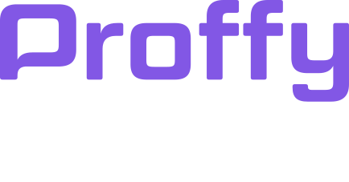
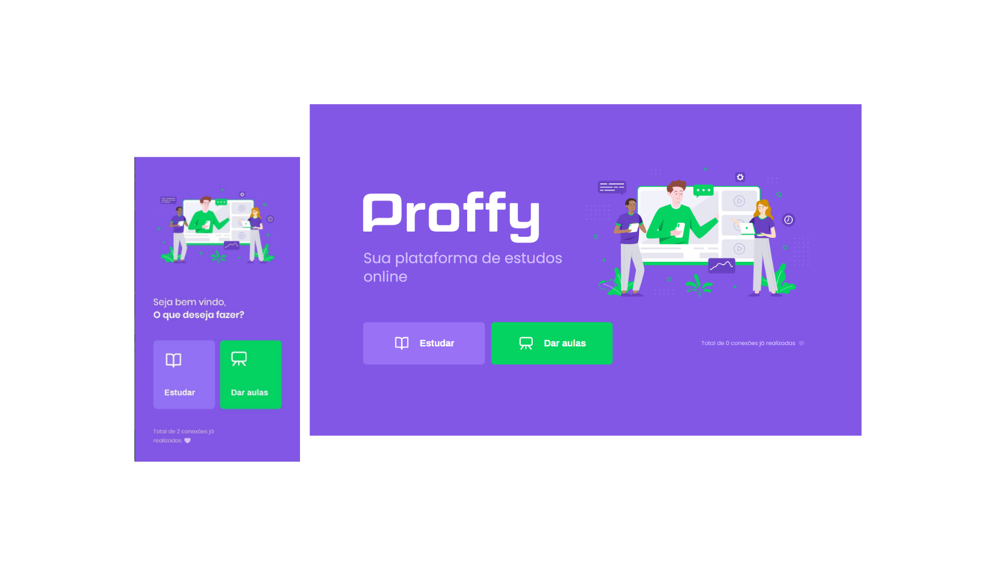

<h1 align="center">
    
</h1>

 

  

  

  

 

## Projeto

**Proffy** - É uma plataforma de estudos online onde alunos podem se conectar com professores.

## Tecnologias

Esse projeto foi desenvolvido com as seguintes tecnologias:

- ##### Back-end:
  - [Node.js](https://nodejs.org/en/)
  - [Express](https://expressjs.com/pt-br/)
  - [Knex.js](http://knexjs.org/)

- ##### Front-end:
- [ReactJS](https://reactjs.org)

- ##### Mobile:
- [React Native](https://facebook.github.io/react-native/)
- [Expo](https://expo.io/)

## Como rodar este projeto?

Este projeto é dividido em três partes:

1. Back End
2. Front End
3. Mobile

### Antes de rodar o projeto

Como pré-requisito para rodar o projeto você precisa ter instalado na sua máquina o [Git](https://git-scm.com), o [Node.js](https://nodejs.org/en/) e um editor de texto da sua preferência (sugiro bastante o [VS_Code](https://code.visualstudio.com/)) :D

## Clonando o projeto

Para começar primeiro clone este projeto, se preferir você também pode baixá-lo como um arquivo .zip acessando o site do [GitHub](https://github.com/DaniloLima122/Proffy)

~~~shell
# Clone este repositório
$ git clone https://github.com/DaniloLima122/Proffy

# Acesse a pasta do projeto pelo seu terminal/cmd
$ cd Proffy
~~~

## Rodando o back-end

~~~shell
# Acesse a pasta "server":
$ cd server

# Instale as dependências:
$ npm install

# Se você usa o Yarn digite:
$ yarn install

# Rode as migrations para criar o banco de dados:
$ npm run knex:migrate

# Ou se você preferir o Yarn, digite:
$ yarn knex:migrate

# Agora é só rodar a aplicação em modo de desenvolvimento:
$ npm run start

# Ou se você usa o Yarn, digite:
$ yarn start

~~~

O Back-end da aplicação será aberto na porta:3333

### Rodando o Front-end

~~~shell
# Acesse a pasta "web":
$ cd web

# Instale as dependências:
$ npm install

# Se você usa o Yarn digite:
$ yarn install

# Agora rode aplicação em modo de desenvolvimento:
$ npm run start

# Ou se você usa o Yarn, digite:
$ yarn start

~~~

O Front-end será aberto na porta:3000 - acesse http://localhost:3000

### Rodando o aplicativo

~~~shell

# Primeiro instale o expo globalmente na máquina:
$ npm install expo-cli — global

# Se vocÊ usa o Yarn digite:
$ yarn add expo-cli — global

# Acesse a pasta "mobile":
$ cd mobile

# Instale as dependências:
$ npm install

# Se você usa o Yarn digite:
$ yarn install

# Agora rode aplicação em modo de desenvolvimento:
$ npm run start

# Ou se você usa o Yarn, digite:
$ yarn start

~~~

O expo vai abrir uma aba no seu navegador em http://localhost:19002/, para ver o app rodando escaneie o QR Code com o seu smartphone ou acesse a URL que ele te disponibiliza

Se preferir você pode instalar um emulador na sua máquina e seguir os mesmos passos anteriores.

## Como contribuir?

Este projeto ainda pode ser melhorado e para contribuir é simples, siga os seguintes passos:

- Faça um fork desse repositório;
- Crie uma branch com a sua feature: `git checkout -b nova-feature`;
- Faça commit das suas alterações: `git commit -m 'my-feature'`;
- Faça push para a sua branch: `git push origin nova-feature`.

Depois que o merge da sua pull request ser concluido, você pode deletar a branch da sua feature.

## Licença

Esse projeto está sob a licença MIT. Veja o arquivo [LICENSE](https://github.com/DaniloLima122/Proffy/blob/master/LICENSE).

## Meus Agradecimentos

- [Equipe RocketSeat](https://rocketseat.com.br/)
- [Diego Fernandes, CTO da Rocketseat](https://github.com/diego3g)

Made with ♥ by Danilo Lima

